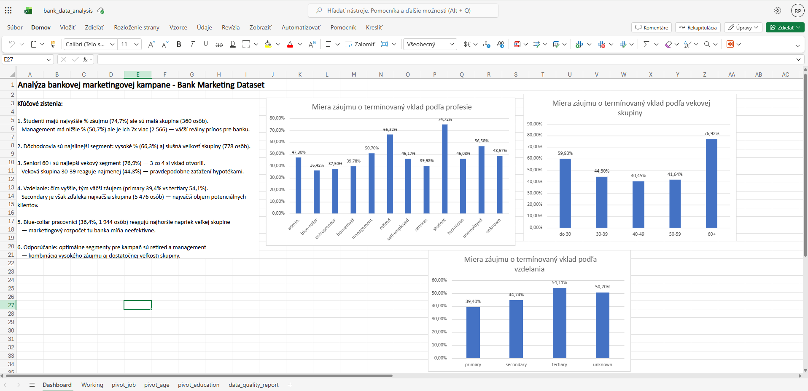

# Analýza bankovej marketingovej kampane

## O projekte
Analýza reálneho datasetu Bank Marketing (UCI Machine Learning Repository, 11 162 záznamov).
Cieľom bolo identifikovať, ktoré segmenty klientov majú najvyšší záujem o termínovaný vklad.

## Nástroje
- Microsoft Excel (kontingenčné tabuľky, grafy, dashboard)

## Kľúčové zistenia
- Študenti (74,7%) a dôchodcovia (66,3%) majú najvyšší záujem o vklad
- Seniori 60+ sú najlepší vekový segment (76,9%)
- Blue-collar pracovníci reagujú najmenej (36,4%)
- Odporúčanie: optimálne segmenty sú retired a management — vysoké % aj veľká skupina

## Obsah repozitára
- `bank_data_analysis.xlsx` — Excel súbor s dashboardom, pivot tabuľkami a Data Quality Reportom

## Dátové zdroje
- [Bank Marketing Dataset — UCI Machine Learning Repository](https://archive.ics.uci.edu/dataset/222/bank+marketing)
## Dashboard

